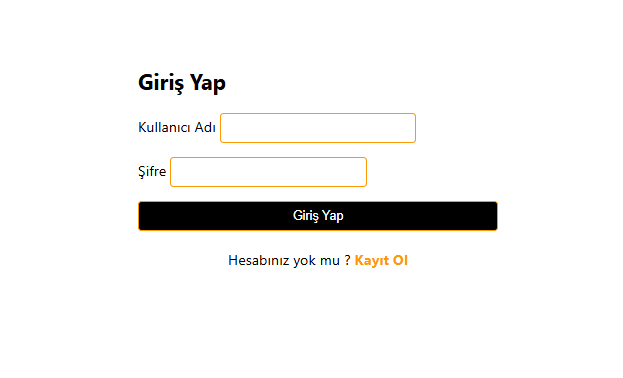
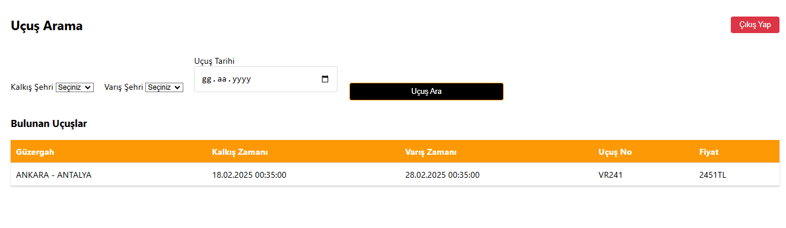
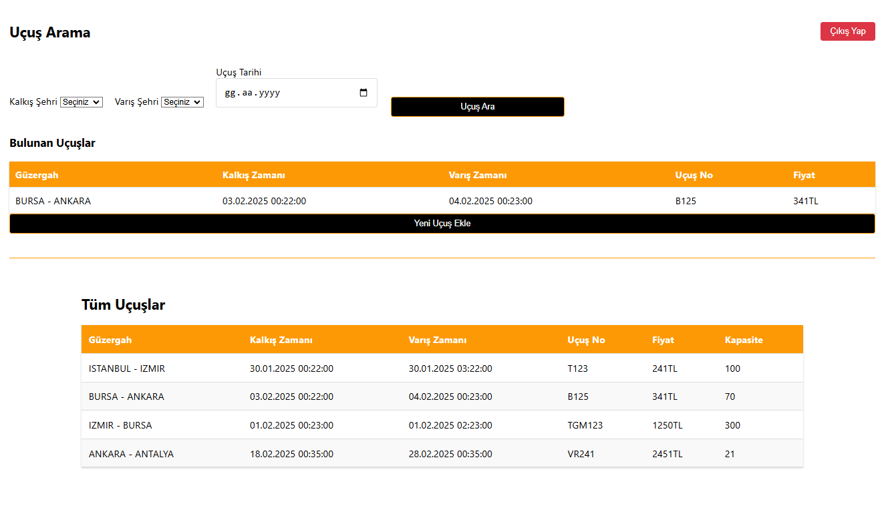
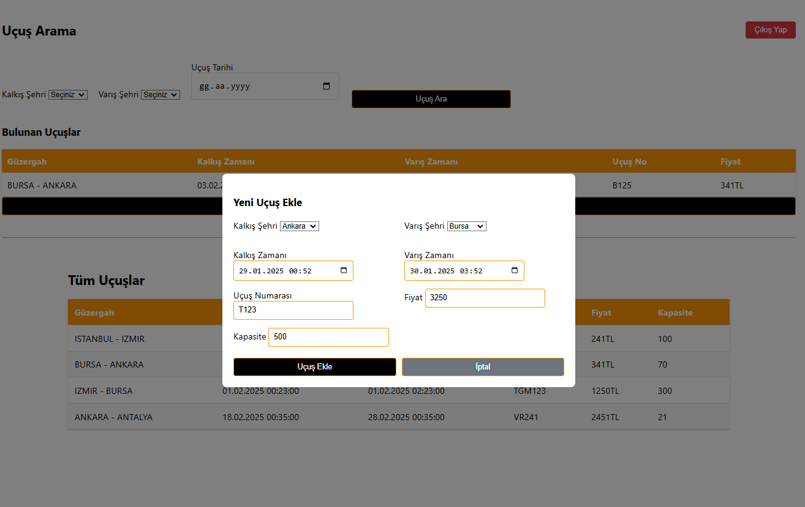
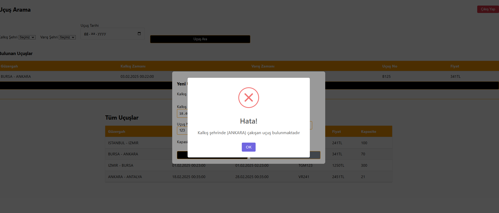

# Odeon Airlines Backend API Documentation

## Overview
Odeon Airlines REST API, uçuş yönetimi ve kullanıcı işlemleri için geliştirilmiş bir backend servisidir.

## Tech Stack
- **Java 17**
- **Spring Boot 3**
- **Flyway**
- **Spring Security + JWT**
- **PostgreSQL**
- **Maven**

## Authentication
API, JWT (JSON Web Token) tabanlı authentication kullanmaktadır. Protected endpoint'lere erişim için geçerli bir JWT token gerekmektedir.

### Swagger
http://localhost:8080/swagger-ui/index.html#/

### Frontend
[https://github.com/Mduzgunn/odeon-airlines](https://github.com/Mduzgunn/odeon-airlines-fe)

## Images

**login page**



**user page**



**admin page**



**admin add flight page**



**error message example**




### Authentication
- **Register** - `POST /api/auth/register`
    - Yeni kullanıcı kaydı oluşturur.
- **Login** - `POST /api/auth/login`
    - Kullanıcı girişi yapar ve JWT token döner.

### Flights
- **Create Flight** - `POST /api/auth/flights`
    - Yeni uçuş kaydı oluşturur. _(Sadece ADMIN yetkisi gereklidir.)_
- **Search Flights** - `GET /api/flights/search`
    - Belirli kriterlere göre uçuş arar.
- **Get Flights by City** - `GET /api/flights/city/{city}`
    - Belirli bir şehirden kalkan uçuşları listeler.
- **Get All Flights** - `GET /api/flights/all`
    - Tüm uçuşları listeler. _(Sadece ADMIN yetkisi gereklidir.)_

## Authorization Rules
| Endpoint                      | Access Level          |
|--------------------------------|-----------------------|
| `/api/auth/**`                 | **Permit All**        |
| `/api/flights`, `/api/flights/all` | **ADMIN only**       |
| `/api/flights/search`, `/api/flights/city/**` | **USER or ADMIN** |

## Validation Rules

### Uçuş Oluşturma
- Kalkış zamanı varış zamanından önce olmalı.
- Aynı gün ve şehirde 30 dakika içinde başka uçuş olmamalı.
- Tüm alanlar doldurulmalı.

### Kullanıcı Kaydı
- Username benzersiz olmalı.
- Tüm alanlar doldurulmalı.

## Error Handling
API hataları standart bir format ile döner.

### Response Format
```json
{
  "status": "success / error",
  "message": "Açıklama mesajı",
  "data": { ... }
}
```


